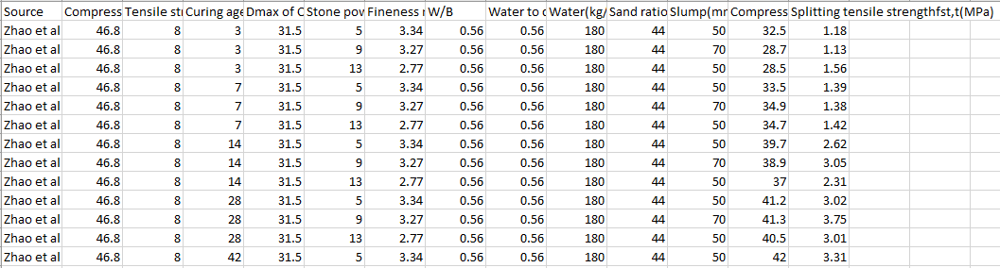

# Tensile strength development of concrete with manufactured sand

```buildoutcfg
Concrete with manufactured sand (MSC) is a potential environmentally friendly building material. With the widespread awareness of the environmentally friendly construction and the sustainability of urbanization development, the supply of natural sand is limited by the governmental protection of farmland and river course. Manufactured sand crushed from stone or gravel, also known as machine-made sand, artificial sand, or crushed-stone sand, has been used as a substitute of natural sand in concrete. 
Machine learning (ML)-based prediction of non-linear composition-strength relationship in concretes requires a large, complete, and consistent dataset. However, the availability of such datasets is limited as the datasets often suffer from incompleteness because of missing data corresponding to different input features, which makes the development of robust ML-based predictive models challenging. Besides, as the degree of complexity in these ML models increases, the interpretation of the results becomes challenging. These interpretations of results are critical towards the development of efficient materials design strategies for enhanced materials performance. 
```
##This model will do predicting the tensile strength & compressive strength of concrete

### DATA SET

A consisted of 755 datasets of splitting tensile strength at different curing days of MSC was assembled from 41 experimental studies.
Raw materials of MSC:
The cement consist of the ordinary silicate cements, the admixture consisted of fly
ash, slag and silica fume. 
The other mixture ingredient i.e.,input features are:

1.crushed stone with maximum grain size: 12 mm ~ 120 mm 
2.manufactured sand with fineness modulus : 2.2–3.55.
3.stone powder in manufactured sand : different maximum particle sizes of 0.075 mm and 0.160 mm were defined.
4.contents of stone powder with particle size of 0 ~ 0.075 mm ranged in 0 ~ 21.8%, 
whereas those with particle size of 0 ~ 0.160 mm varied in 0 ~ 40%. 
5.the water-binder ratio W/B = 0.24 ~ 1.00, 
6.the water-cement ratio mw/mc = 0.30 ~ 1.43. 
7.the sand ratio was 24% ~ 54%. 
8.the slump of fresh MSC varied from 10 mm to 260 mm, # was not consider
9.the curing time of specimens ranged from 1 day to 388 days. 
10. compressive strength of cement 
11. tensile strength of cement binder

##As Data set have few missing values.

above data is before missing value handling

###Missing values can be handle by following methods:
```buildoutcfg
It has been observed that KNN with K=10 gives least r-square and RMSE for the data.
```
The best methods are XGBoost for prediction of concrete strength.

###Input features were

1. Compressive strength of cement binder
2. Tensile Strength of cement binder
3. Curing time (days) 
4. Crushed stone size (mm) 
5. Stone powder content
6. Fineness_modulus (GPa) 
7. Water_binder_ratio
8. Water_cement_ratio
9. Water (kg/m^3)
10. Sand_ratio

### Output variable 
1. Compressive strength of concrete with manufacturing sand at 28day
2. Spliting tensile strength of concrete with manufacturing sand at 28day

### Aproach
1. Data Exploration     : I started exploring dataset using pandas,numpy,matplotlib and seaborn. 
2. Data visualization   : Ploted graphs to get insights about dependend and independed variables.
3. Model Selection I    :  Tested all base models to check the base accuracy.
4. Model Selection II   :  Performed Hyperparameter tuning using gridsearchCV.
5. Pickle File          :  Selected model as per best accuracy and created pickle file using Pickle .
6. Webpage & deployment :  
   1. Created a web form that takes all the necessary inputs from user and shows output.
   2. Using Circle Ci and docker-hub , application is deployed on heruko 
 

## USER Interface
1. Main Page:

2. Predictive page:


## Deployment Link
[Heroku Link](https://concretestrengthusingml.herokuapp.com/)

## Technology Used
1. Python
2. Sklearn
3. Pandas
4. Numpy
5. Flask
6. HTML
7. AWS
8. Heroku
